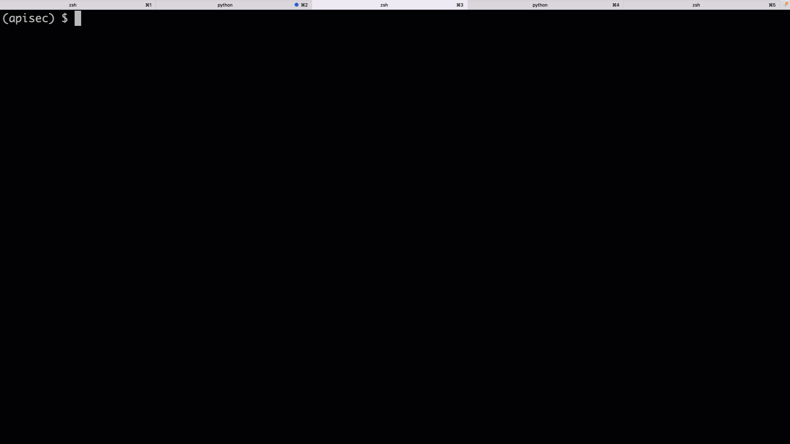

# Fencer

[](https://pypi.python.org/pypi/fencer)
[](https://github.com/abunuwas/fencer)

Automated API security testing tool. 

**DO NOT run this against production!!**

Fencer is an automated API security testing tool. It's an experimental project to see how much of the API
security testing process can be automated. I believe that API security testing requires a holistic approach. 
An API is part of a bigger system, and the security configuration of the whole system affects the security of 
the API. However, it's also true that many security tests on APIs are easy to formalize and hence automate. The 
goal of this project is to capture all those formal test cases.

The starting point is the [OWASP Top 10 API Security Threats](https://owasp.org/www-project-api-security/) 
checklist. The goal is to create automated tests for each of those threats. Once we've covered OWASP, the goal
is to move beyond the checklist and add more tests for all sorts of common API security vulnerabilities. If you 
have suggestions about cases that should be covered and don't appear in the OWASP checklist, please raise an issue!

Use fencer responsibly. I suggest running fencer against development environments, or even better, against 
ephemeral environments in which you can do no harm to your systems. I'd generally advise against running fencer 
directly against production.  

---

## Requirements

Python 3.7+

## Installation

To install fencer, run the following command: 

```bash
$ pip install -U fencer
```

## Running fencer

After installation, you can run fencer directly from the command line. The basic test suite runs like this:

```bash
$ fencer --oas-file <path_to_openapi_spec> --base-url <base_url>
```

Replace `<path_to_openapi_spec>` with the path to the OpenAPI specification for your API in your local machine.
It only works with JSON specs at the moment. Replace also `<base_url>` with the base URL of the server you want
to test against.

For example:

```bash
$ fencer run --oas-file openapi.json --base-url http://localhost:5000
```



## Contributing

Clone the repository and install it locally by running:

```bash
$ pipenv install -e .
```

I'm just getting started with this project, and I could use some help! I'll be uploading a contribution guideline
in the coming days, but if you have suggestions in the meantime, please raise an issue and let's have a chat!
